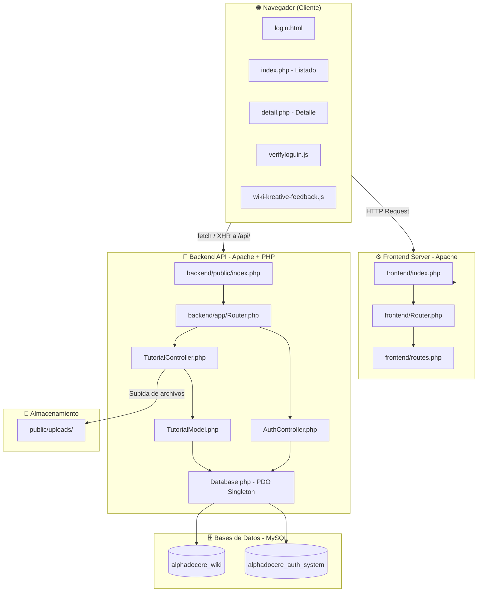
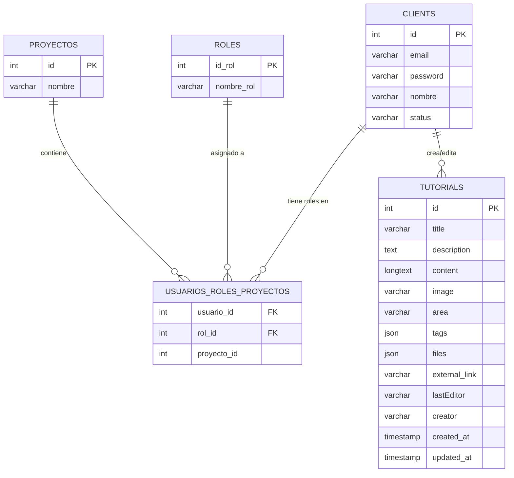
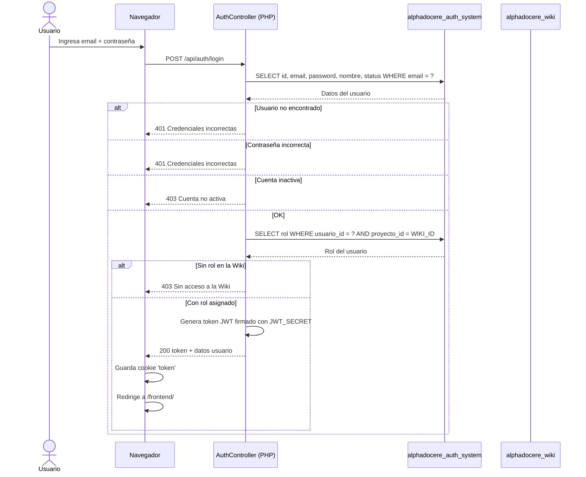
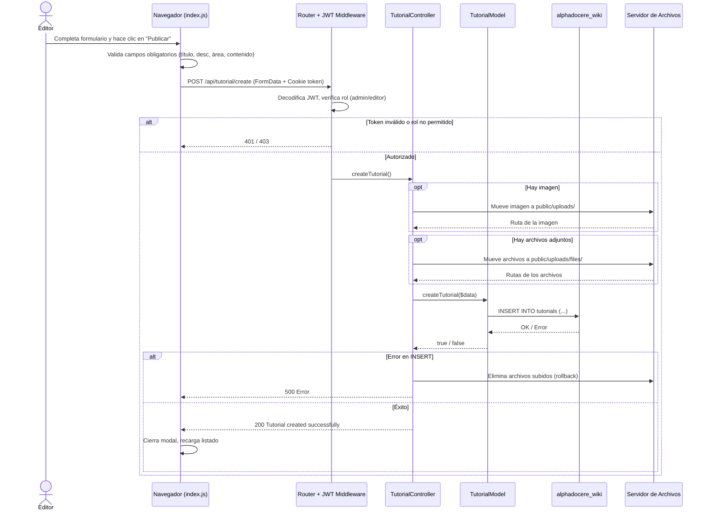
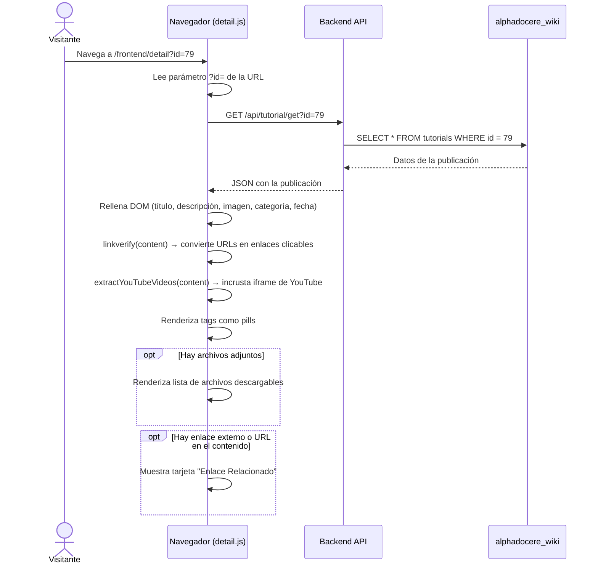
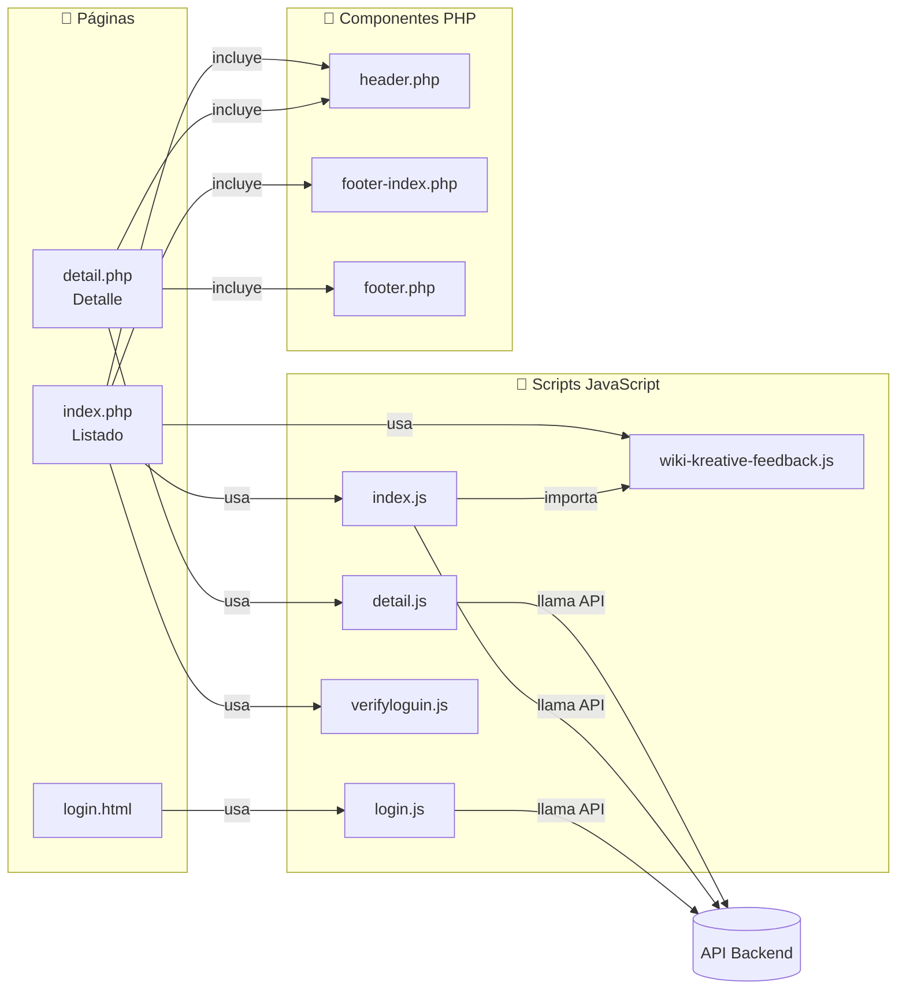
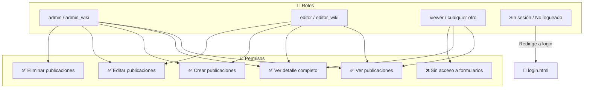
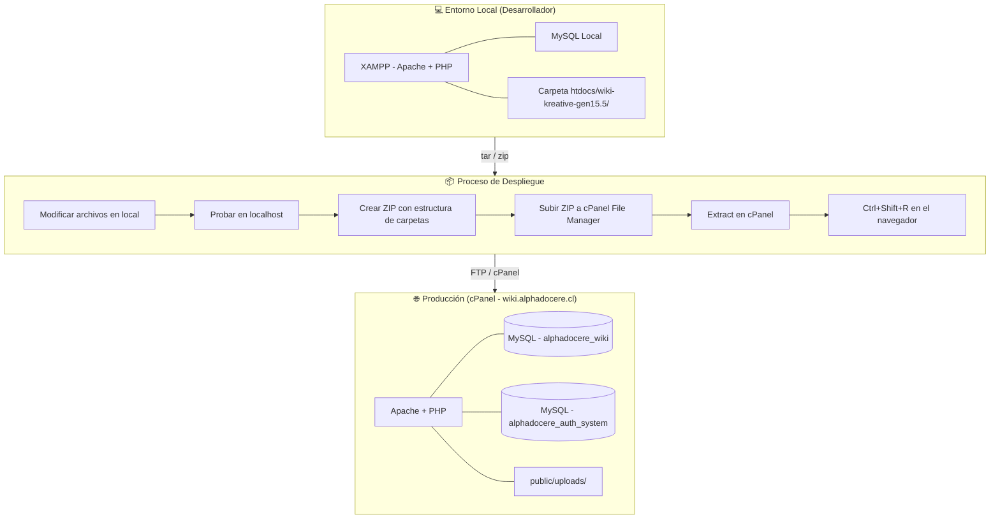
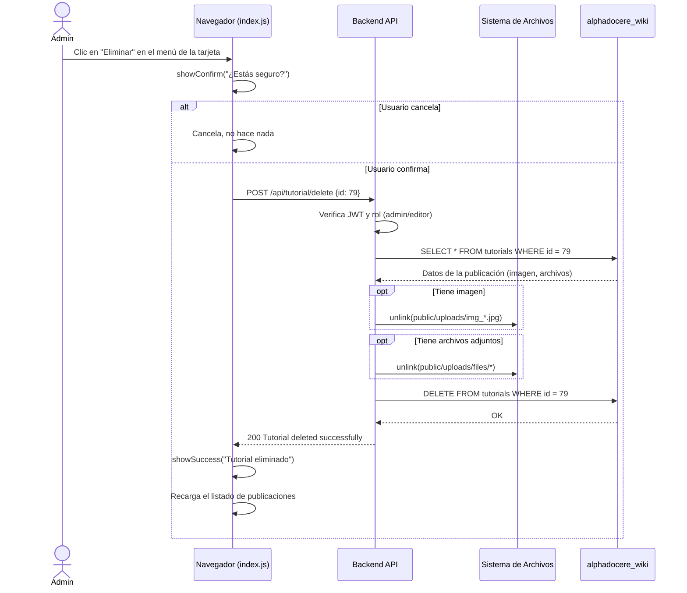

# 09 — Diagramas del Sistema

Colección de diagramas técnicos y de flujo del proyecto **Wiki KREATIVE Gen 15.5**.

---

## 1. Diagrama de Arquitectura General

Vista general de las capas del sistema y cómo se comunican entre sí.

---

## 2. Diagrama Entidad-Relación (Base de Datos)

> **Nota:** Las tablas `CLIENTS`, `ROLES`, `USUARIOS_ROLES_PROYECTOS` y `PROYECTOS` pertenecen a la BD `alphadocere_auth_system`. La tabla `TUTORIALS` pertenece a la BD `alphadocere_wiki`.

---

## 3. Diagrama de Flujo — Autenticación (Login)

---

## 4. Diagrama de Flujo — Crear Publicación

---

## 5. Diagrama de Flujo — Ver Detalle de Publicación

---

## 6. Diagrama de Componentes Frontend

---

## 7. Diagrama de Roles y Permisos

---

## 8. Diagrama de Despliegue

---

## 9. Diagrama de Secuencia — Eliminar Publicación

